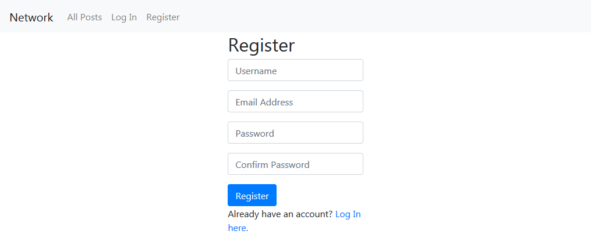

# Network

    This is a simple, Twitter-like social network that allows users to make posts, follow other users, and “like” posts.

    The code is in Python, JavaScript, HTML, and CSS.

### List of most important tools used in this project are :

* Django templates for rendering html page with a back-end context.

* Django forms to build forms and valide them.

* Django models to store the necessary data for the web application.
    
* Django’s Paginator for implementing pagination on the back-end.

* Bootstrap’s Pagination for displaying pages on the front-end.

* JavaScript fetch calls (using GET and PUT requests) to asynchronously edit or like/unlike posts.

### App features:

* __New Post:__ Users who are signed in can write a new text-based post by filling in text into a text area and then clicking a button to submit the post.

* __All Posts:__ The “All Posts” link in the navigation bar takes the user to a page where they can see all posts from all users, with the most recent posts first.

* __Profile Page:__ Clicking on a username loads that user’s profile page. 

* __Following:__ The “Following” link in the navigation bar takes the user to a page where they see all posts made by users that the current user follows.

* __Pagination:__ On any page that displays posts, the posts are displayed 10 on a page. 

* __Edit Post:__ : Users can click an “Edit” button on any of their own posts to edit that post.

* __“Like” and “Unlike”:__ Users scan click a button on any post to toggle whether or not they “like” that post.

### Screenshots:

Register:

Main page
.png)

